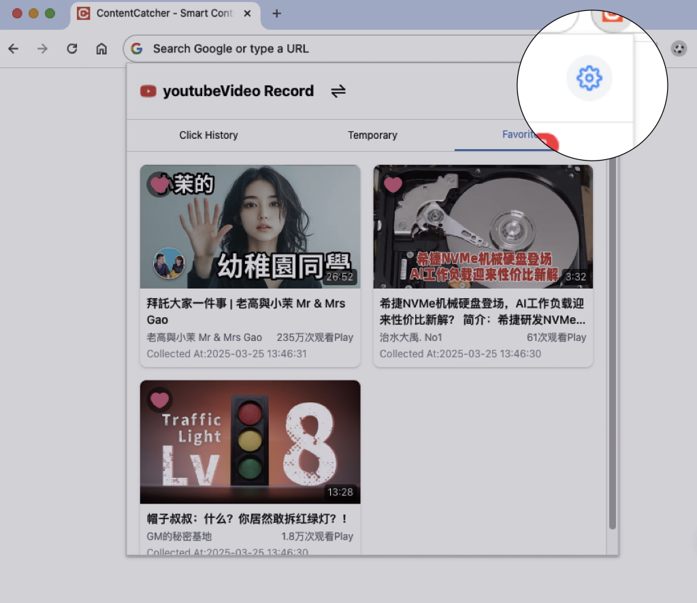
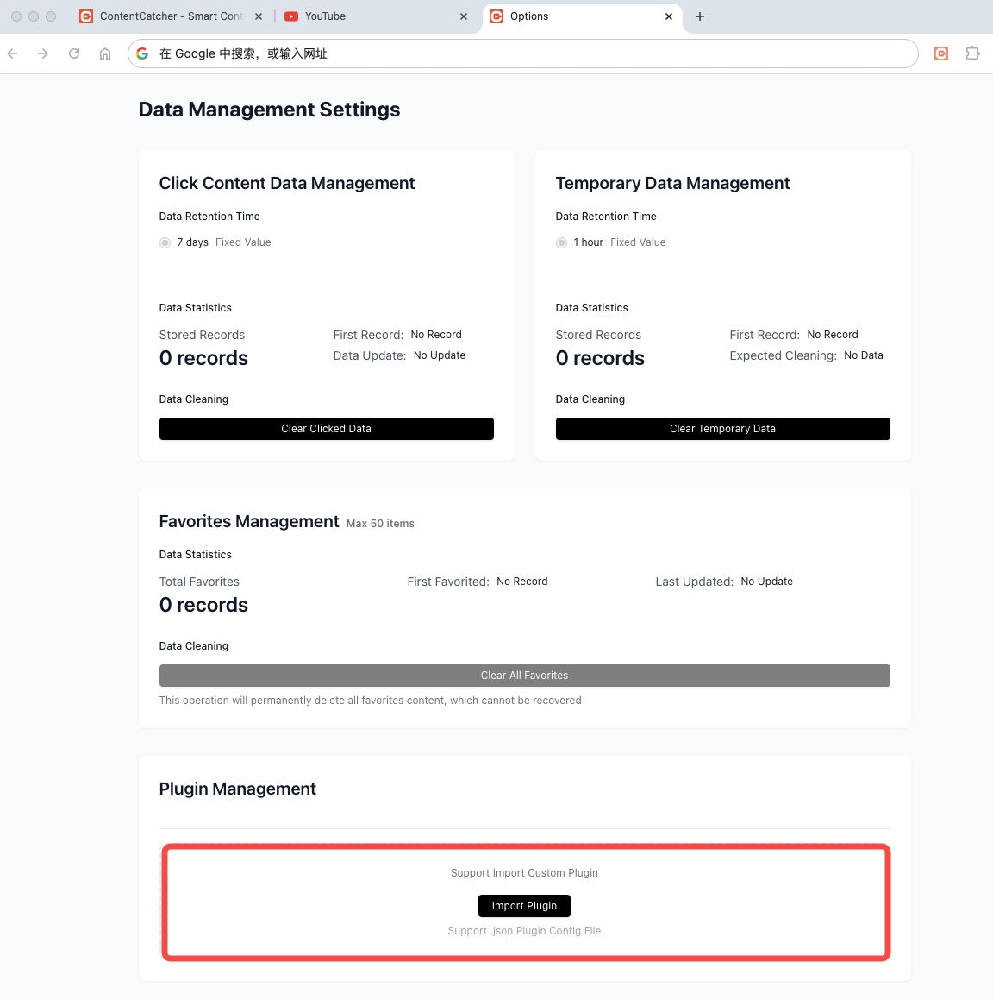
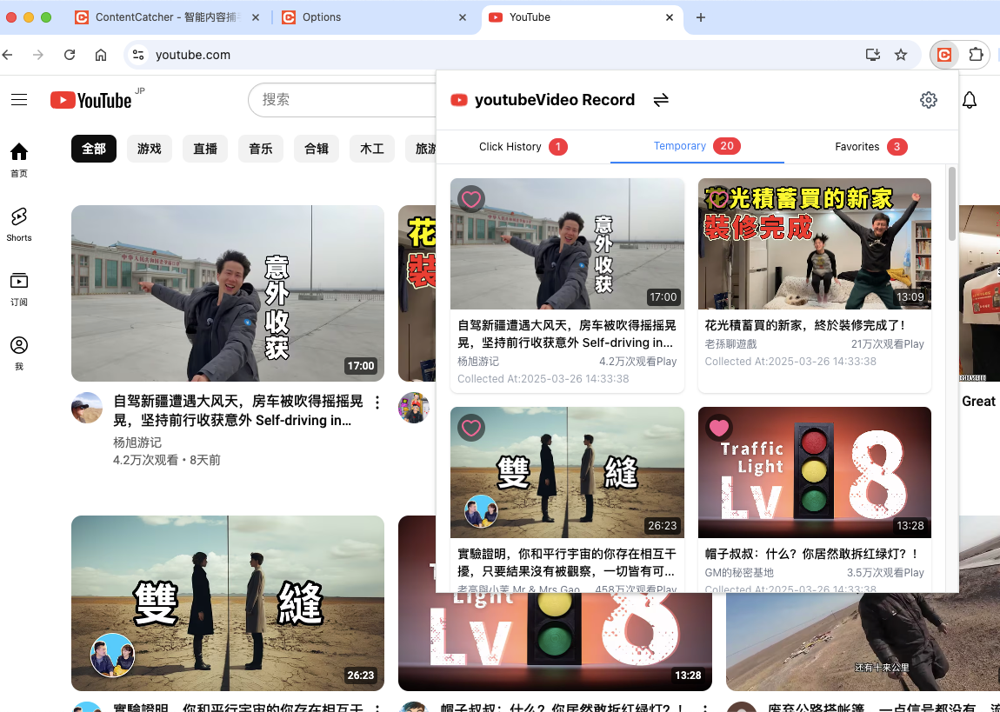
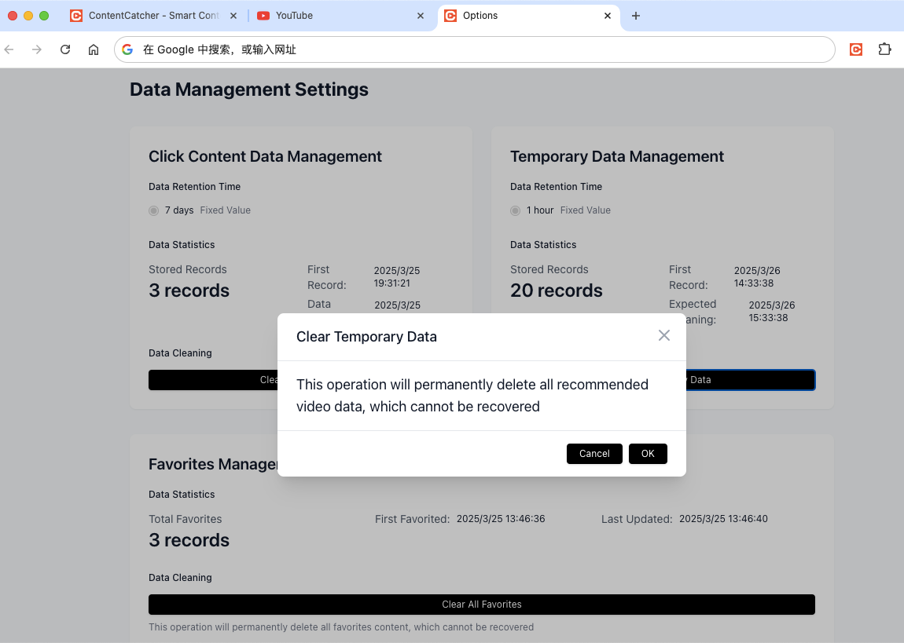
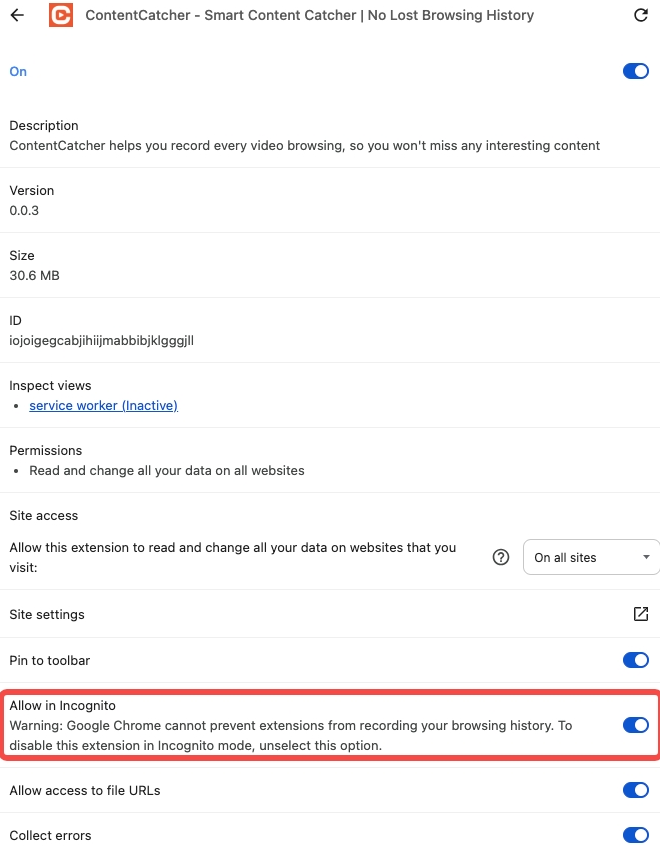

# ContentCatcher - Smart Content Catcher | No Lost Browsing History

[🌟 English](README.md) | [🇨🇳 中文](README_CN.md) 

  <a href="https://chrome.google.com/webstore/detail/hdicimgeggokokkjfcamkegbpbcebogd">
    Chrome Web Store
  </a>
  &nbsp;&nbsp;&nbsp;&nbsp;
  <a href="https://microsoftedge.microsoft.com/addons/detail/giofekcbjmconbpfnogaonlebjecnael">
    Edge Add-ons
  </a>

## Table of Contents

- [Introduction](#introduction)
- [Core Features](#core-features)
- [Getting Started](#getting-started)
- [Plugin List](#plugin-list)

## Introduction

**ContentCatcher** helps you record every video browsing, so you won't miss any interesting content

🔥 Every video browsing is recorded, never miss interesting content, your best companion to break free from algorithmic filter bubbles.

## Core Features

### 🕸️ Video Content Capture
- **Auto Capture**: Silently captures video content in the background, preserving your browsing history even without manual bookmarking
- **Multi-Platform Support**: Works with platforms like Bilibili/YouTube, with an extensible plugin architecture for any video site
- **Incognito Mode**: Fully functional in incognito mode, helping you break free from algorithmic recommendations
- **Smart Filtering**: Automatically filters out ads, keeping only valuable video content

### 📋 Intelligent Content Management
- **Clean Interface**: Browse your video history with a clean, platform-categorized interface
- **Smart Storage**: Intelligent data management - keeps temporary records for a week, with one-click permanent saving for important content
- **Auto Deduplication**: Automatically merges duplicate entries when you watch the same video multiple times

### 🔐 Privacy & Security
- **Local Storage**: All data stays on your device - no server uploads, complete privacy
- **Lightweight**: Zero impact on your browsing experience
- **User Control**: No account needed - you have full control over your data

### 🧩 Extensions & Customization
- **Plugin System**: Open plugin architecture lets developers add support for more video platforms
- **Browser Support**: Works seamlessly with major browsers (Chrome/Edge)

---

**ContentCatcher** is completely free, helping you keep track of interesting content in this information-rich era, making every browsing session memorable. ❤️

## Getting Started

### Installation & Plugin Setup
ContentCatcher requires plugins to work with different video platforms. Here's how to set it up:

1. Install ContentCatcher from the Chrome Web Store (or other browser extension stores).
2. Open the extension settings page by clicking on the ContentCatcher icon and selecting "Settings".
   
   

3. Download official plugins from the GitHub repository (https://github.com/GoldTools/ContentCatcher/tree/main/plugins).
4. Drag the downloaded plugins into the ContentCatcher plugin management page.
   
   

> Note: Removing a plugin will automatically delete all video records associated with that platform.

### Basic Usage
After installing ContentCatcher and importing plugins, visit supported websites to start capturing video content automatically.

#### Features
- **Browsing History**: Videos you manually click or actively visit are recorded in the browsing history tab.
- **Recommended Videos**: Algorithm-recommended videos that appear when refreshing websites are captured in the recommended tab.
- **Favorites**: Videos you manually bookmark in our extension are stored permanently in the favorites tab.

### Data Management
ContentCatcher manages your data intelligently:
- Browsing history is kept for 7 days by default
- Recommended video records are kept for 1 hour by default
- Favorited videos are kept permanently until manually deleted

### Incognito Mode Support
To use ContentCatcher in incognito mode:
1. Open your browser's extension management page (e.g., chrome://extensions/)
2. Find ContentCatcher, click "Details", and enable the "Allow in Incognito" option

## Plugin List
[Pugin List](./plugins/README.md)