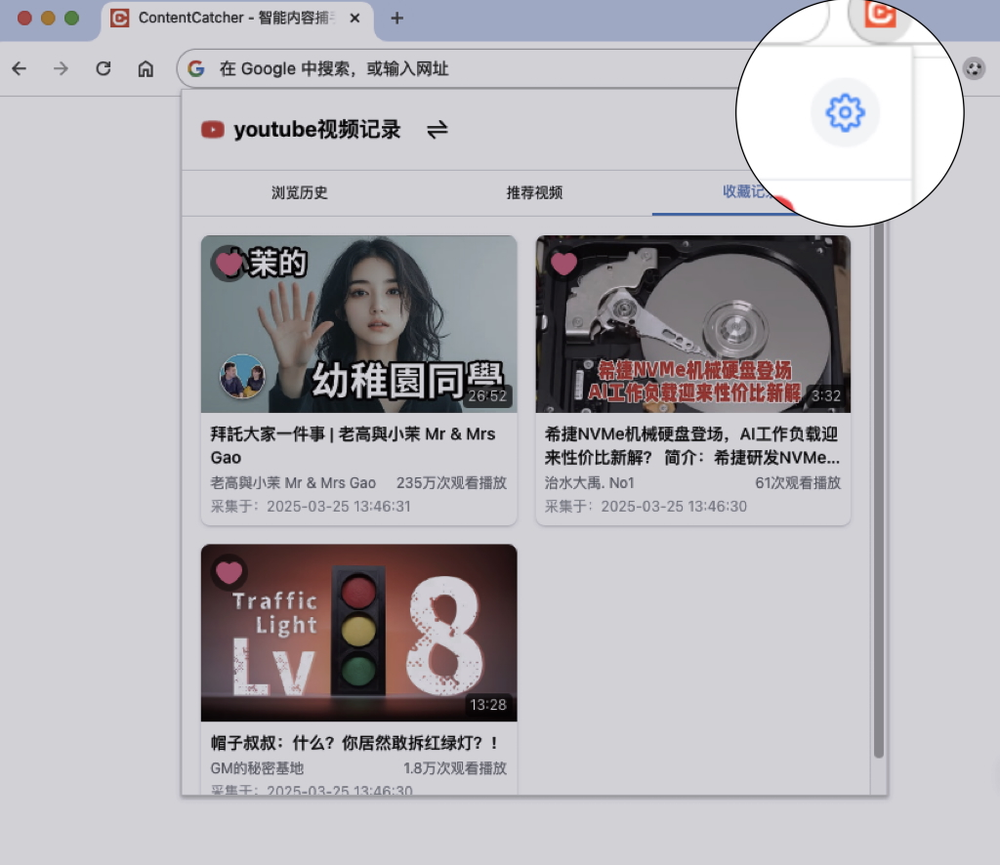
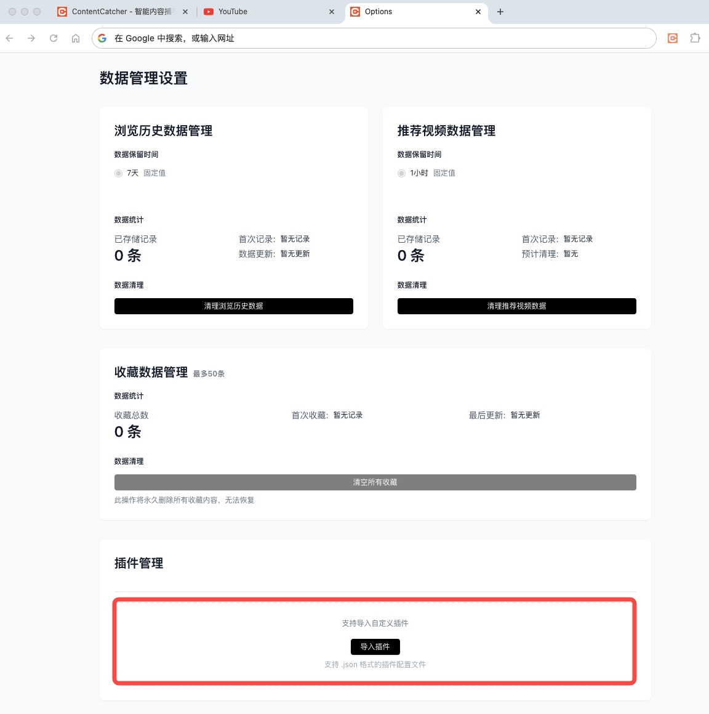
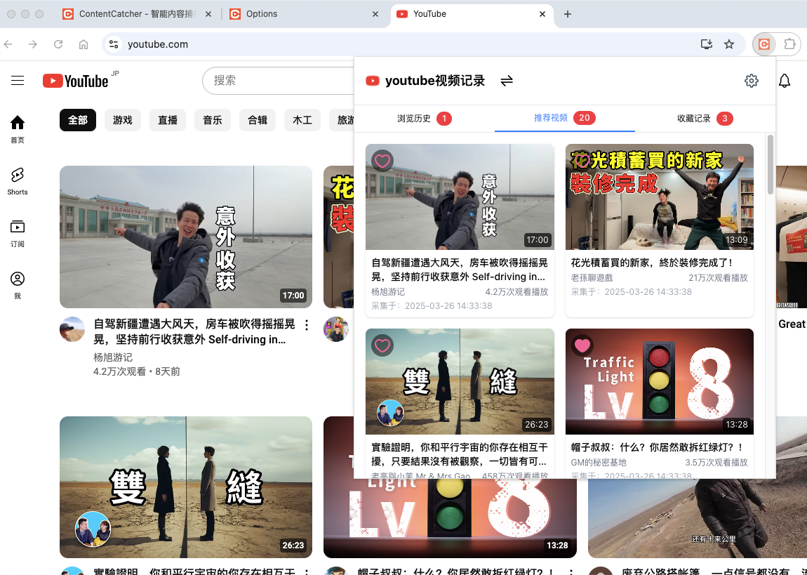
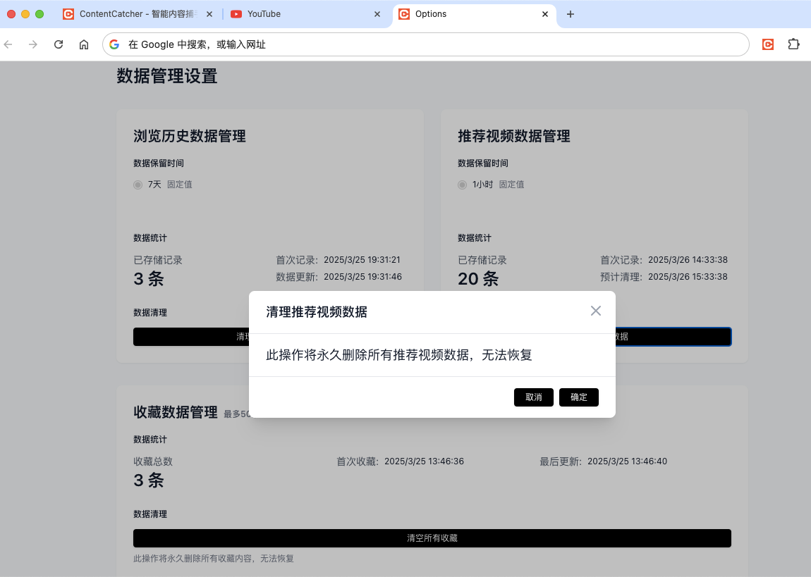
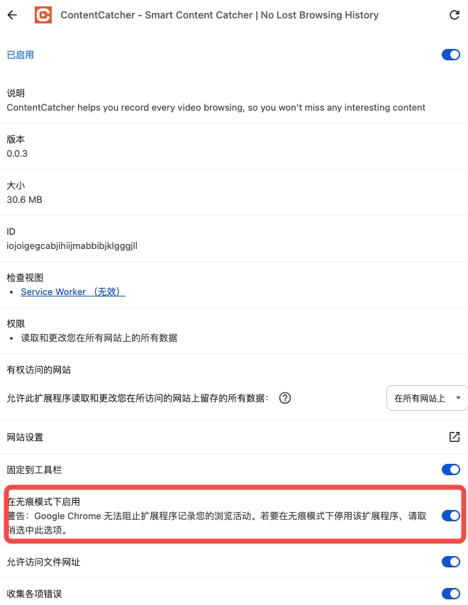

# ContentCatcher - 智能内容捕手 | 视频浏览记录不丢失

[🇺🇸 English](README.md) | [🌟 中文](README_CN.md) 

  <a href="https://chrome.google.com/webstore/detail/hdicimgeggokokkjfcamkegbpbcebogd">
    Chrome 应用商店
  </a>
  &nbsp;&nbsp;&nbsp;&nbsp;
  <a href="https://microsoftedge.microsoft.com/addons/detail/giofekcbjmconbpfnogaonlebjecnael">
    Edge 插件商店
  </a>

## 目录

- [简介](#简介)
- [功能特性](#功能特性)
- [开始使用](#开始使用)
- [插件列表](#插件列表)

## 简介

**ContentCatcher** 让每一次视频浏览都被记录，不再错过感兴趣的内容，对抗算法茧房的最佳助手。

🔥 让每一次视频浏览都被记录，不再错过感兴趣的内容，对抗算法茧房的最佳助手。

## 功能特性

### 🕸️ 视频内容捕获
- **自动捕获**：后台静默捕获浏览的视频内容，即使未主动收藏也不会丢失
- **多平台支持**：支持B站/Youtube等平台，通过插件化架构可扩展支持任意视频网站
- **无痕浏览**：支持无痕浏览模式下的内容捕获，帮助你突破算法推荐的信息茧房
- **智能过滤**：智能过滤广告内容，只保留真正有价值的视频信息

### 📋 智能内容管理
- **简洁界面**：简洁清晰的浏览记录界面，支持按平台分类查看历史视频
- **智能分级**：智能数据分级，临时浏览记录保留一周，重要内容一键永久收藏
- **自动去重**：智能去重功能，自动合并相同视频的多次浏览记录

### 🔐 隐私与安全
- **本地存储**：所有数据完全存储在本地，无服务器上传，保护个人隐私
- **轻量设计**：轻量级设计，对浏览体验零影响
- **用户控制**：无需注册账号，数据完全由用户控制

### 🧩 扩展与定制
- **插件化架构**：开放的插件化架构，开发者可按配置说明扩展支持更多视频平台
- **广泛兼容**：支持主流浏览器（Chrome/Edge），提供一致的使用体验

---

**ContentCatcher** 完全免费，帮你在信息爆炸的时代不再错过真正感兴趣的内容，让每一次浏览都有迹可循。 ❤️

## 开始使用

### 安装与插件设置
ContentCatcher 需要插件才能与不同视频平台配合使用。以下是设置步骤：

1. 从 Chrome 网上应用店（或其他浏览器扩展商店）安装 ContentCatcher
2. 点击 ContentCatcher 图标并选择"设置"，打开扩展设置页面
   
   

3. 从 GitHub 仓库下载官方插件（https://github.com/GoldTools/ContentCatcher/tree/main/plugins）

4. 将下载的插件拖入 ContentCatcher 的插件管理页面
   
   

> 注意：删除插件后会自动删除该插件对应平台的所有视频记录。

### 基本使用
安装 ContentCatcher 并导入插件后，访问支持的网站即可自动开始捕获视频内容。

#### 功能特点
- **浏览历史**：用户手动点击或主动访问的视频会记录在浏览历史标签中
- **推荐视频**：网站刷新后算法推荐的视频会被记录在推荐标签中
- **收藏记录**：用户在插件中主动点击收藏的视频会永久存储在收藏标签中

### 数据管理
ContentCatcher 采用智能的数据管理机制：
- 浏览历史默认保留 7 天
- 推荐视频记录默认保留 1 小时
- 收藏数据永久保留，除非手动删除

> 注意：删除插件后会自动删除该插件对应平台的所有视频记录。

### 无痕模式支持
要在无痕模式下使用 ContentCatcher：
1. 打开浏览器的扩展管理页面（例如，chrome://extensions/）
2. 找到 ContentCatcher，点击"详情"，并启用 "在无痕模式下启用" 选项

## 插件列表
[插件列表](./plugins/README_CN.md)